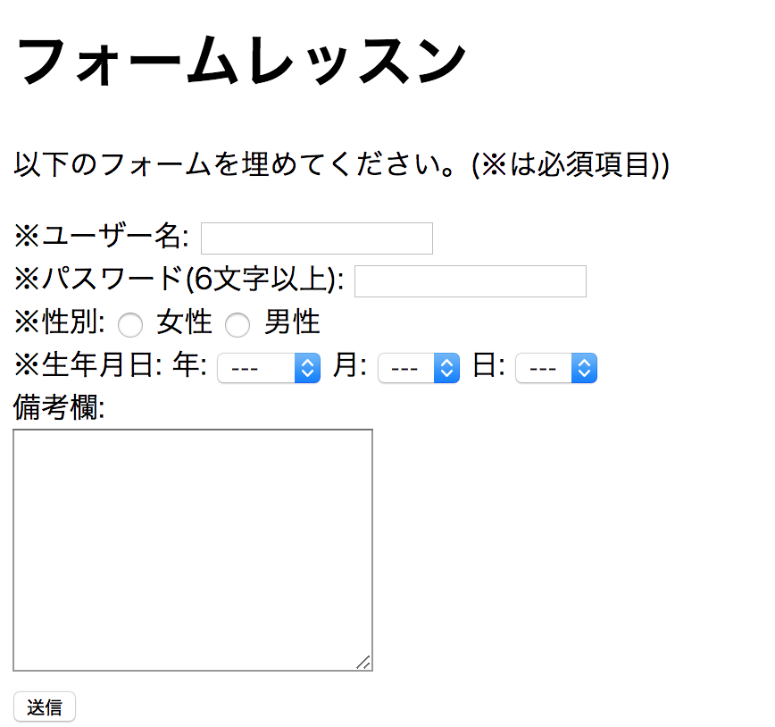
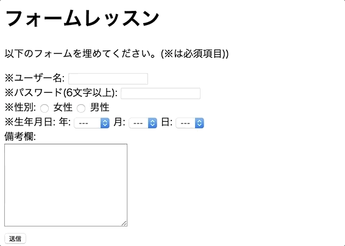

# レポジトリ内容

このレポジトリは[Web白熱教室](https://tsuyopon.xyz/)の[HTMLの学習コンテンツ](https://tsuyopon.xyz/learning-contents/web-dev/html/)にある「[【エクササイズ】HTMLのフォーム作成の復習](https://tsuyopon.xyz/learning-contents/web-dev/html/excercise-form-in-html/)」で利用するものです。

## 課題

以下の完成形と同じページを作ってください。(バリデーションの挙動は **完成形(動画)** をご確認ください。)

**完成形(静止画)**

**完成形(動画)**

### 課題をクリアするためのステップ

- [ ] ユーザー名を入力するフォームを作成してください。
  - [ ] テキスト「ユーザー名:」の部分はlabelタグを使ってください。
  - [ ] labelタグとinputタグを連携して、「ユーザー名:」をクリックしてもinputフォームに入力できる状態にしてください。
  - [ ] ユーザー名は「入力必須」にしてください。
- [ ] パスワードを入力するフォームを作成してください。
  - [ ] パスワードに入力した内容は見えないようにしてください。
  - [ ] テキスト「パスワード(6文字以上):」の部分はlabelタグを使ってください。
  - [ ] labelタグとinputタグを連携して、「パスワード(6文字以上):」をクリックしてもinputフォームに入力できる状態にしてください。
  - [ ] パスワードは6文字以上の入力を必須にしてください。
- [ ] 性別を選択するフォームを作成してください。
  - [ ] 「女性」「男性」部分はそれぞれlabelタグを使ってください。
  - [ ] labelタグとinputタグを連携して、テキスト部分をクリックしても選択出来るようにしてください。
    - [ ] 「女性」テキストをクリックしたら、左の方にチェックが入る。
    - [ ] 「男性」テキストをクリックしたら、右の方にチェックが入る。
  - [ ] テキスト「パスワード(6文字以上):」の部分はlabelタグを使ってください。
  - [ ] 性別の選択は必須にしてください。
  - [ ] 「女性」もしくは「男性」のうちいずれか1つだけしか選択できないようにしてください。
- [ ] 生年月日を選択するフォームを作成してください。
  - [ ] 「年」「月」「日」をドロップダウン型の選択ボックスで選択できるようにしてください。
    - [ ] 「年」選択できる項目は次の通り
      - [ ] 表示は「---」で値は空文字列(value="")
      - [ ] 表示は「2000」で値は"2000"(value="2000")
      - [ ] 表示は「2001」で値は"2001"(value="2001")
      - [ ] 表示は「2002」で値は"2002"(value="2002")
    - [ ] 「月」選択できる項目は次の通り
      - [ ] 表示は「---」で値は空文字列(value="")
      - [ ] 表示は「1」で値は"2000"(value="1")
      - [ ] 表示は「2」で値は"2001"(value="2")
      - [ ] 表示は「3」で値は"2002"(value="3")
      - [ ] 表示は「12」で値は"2002"(value="12")
    - [ ] 「日」選択できる項目は次の通り
      - [ ] 表示は「---」で値は空文字列(value="")
      - [ ] 表示は「1」で値は"2000"(value="1")
      - [ ] 表示は「2」で値は"2001"(value="2")
      - [ ] 表示は「3」で値は"2002"(value="3")
      - [ ] 表示は「31」で値は"2002"(value="31")
  - [ ] 「年」「月」「日」の入力は必須にしてください。
- [ ] 備考欄を入力するフォームを作成してください。
  - [ ] 複数行入力できるフォームを利用してください。(`<input type="text">`を使わない)
  - [ ] 入力は任意でOK。(必須ではない。)

## 答え

この課題の答えは、このレポジトリの「index.html」の中身になります。
すぐに答えを見ずに、まずはじめに自分の力だけでチャレンジして、どうしてもわからなくなったら中身を見て、理解したらindex.htmlを閉じて再び自分の力で完成させてください。

## ヒント

以下の学習コンテンツで学習した内容を元に出しているので、以下の記事を参考にしていただければ回答にたどり着けるかと思います。

- [HTMLのフォームの概要を理解する](https://tsuyopon.xyz/learning-contents/web-dev/html/overview-of-form/)
- [HTMLのinputタグの使い方を覚える](https://tsuyopon.xyz/learning-contents/web-dev/html/how-to-use-input-in-html/)
- [HTMLのformタグの使い方を覚える](https://tsuyopon.xyz/learning-contents/web-dev/html/how-to-use-form-in-html/)
- [HTMLのlabelタグの使い方を覚える](https://tsuyopon.xyz/learning-contents/web-dev/html/how-to-use-label-in-html/)
- [HTMLのフォームバリデーションの使い方を覚える](https://tsuyopon.xyz/learning-contents/web-dev/html/how-to-use-form-validation-in-html/)
- [HTMLのselectタグ・optionタグの使い方を覚える](https://tsuyopon.xyz/learning-contents/web-dev/html/how-to-use-select-and-option/)
- [HTMLのtextareaタグの使い方を覚える](https://tsuyopon.xyz/learning-contents/web-dev/html/how-to-use-textarea/)
