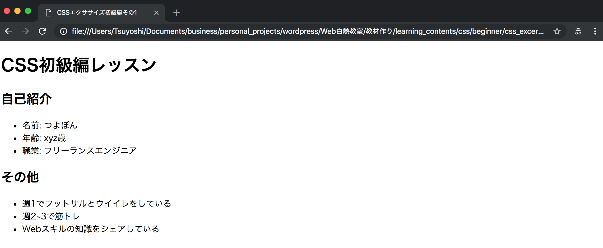
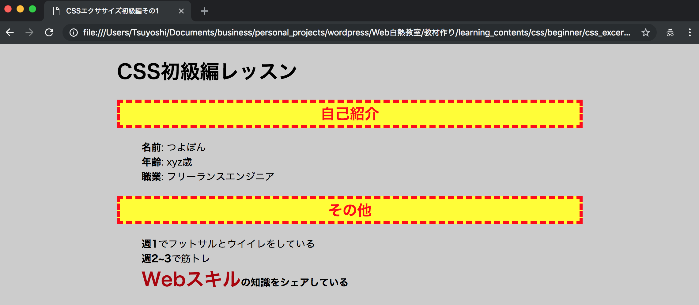

# レポジトリ内容

このレポジトリは[Web白熱教室](https://tsuyopon.xyz/)の[CSSの学習コンテンツ](https://tsuyopon.xyz/learning-contents/web-dev/css/)にある「[【エクササイズ】CSS初級編の総復習](https://tsuyopon.xyz/learning-contents/web-dev/css/css_excercise_for_beginner_part_1/)」で利用するものです。

## 課題

以下の完成形と同じページを作ってください。

**完成前**

**完成後**

### 課題をクリアするためのステップ

- [ ] index.htmlに手を付ける(修正する)のは厳禁です。
- [ ] styles.css内のコメントに従ってcssを定義してください。(完成後の画像と同じになればクリアです)

## 答え

この課題の答えは、このレポジトリの「answer.css」の中身になります。
すぐに答えを見ずに、まずはじめに自分の力だけでチャレンジして、どうしてもわからなくなったら中身を見て、理解したらanswer.cssを閉じて再び自分の力で完成させてください。

## ヒント

以下の学習コンテンツで学習した内容を元に出しているので、以下の記事を参考にしていただければ回答にたどり着けるかと思います。

- [CSSの役割を知る](https://tsuyopon.xyz/learning-contents/web-dev/css/understand-how-css-works/)
- [CSSの基本構造を理解する](https://tsuyopon.xyz/learning-contents/web-dev/css/understand-structure-of-css/)
- [HTMLとCSSの連携方法を知る](https://tsuyopon.xyz/learning-contents/web-dev/css/how-to-attach-style/)
- [CSSで色を設定するやり方を知る](https://tsuyopon.xyz/learning-contents/web-dev/css/how-to-set-color-in-css/)
- [CSSのbackgroundとborderを理解する](https://tsuyopon.xyz/learning-contents/web-dev/css/understand-background-and-border-in-css/)
- [CSSボックスモデルを理解する](https://tsuyopon.xyz/learning-contents/web-dev/css/understand-css-box-model/)
- [CSSの基本セレクター3つを理解する](https://tsuyopon.xyz/learning-contents/web-dev/css/understand-3-basic-selectors-in-css/)
- [CSSの3つの基本セレクター以外に見かける4つの書き方を覚える](https://tsuyopon.xyz/learning-contents/web-dev/css/understand-other-selectors-in-css/)
- [デベロッパーツールを使ってリアルタイムにスタイルを変更する方法](https://tsuyopon.xyz/learning-contents/web-dev/css/change-style-with-developer-tool/)
- [CSSの継承と優先度を理解する](https://tsuyopon.xyz/learning-contents/web-dev/css/understand-inheritance-and-priority-of-css/)
