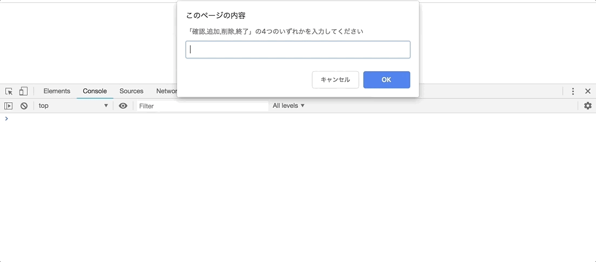

# レポジトリ内容

このレポジトリは[Web白熱教室](https://tsuyopon.xyz/)の[HTMLの学習コンテンツ](https://tsuyopon.xyz/learning-contents/web-dev/html/)にある「[【エクササイズ】HTMLでのテーブル作成の復習](https://tsuyopon.xyz/learning-contents/web-dev/html/excercise-table-in-html/)」で利用するものです。

## 課題

以下の完成形と同じページを作ってください。

**完成形**

### 課題をクリアするためのステップ

- [ ] テーブルのタイトル(見出し)には以下の項目を書いてください
  - [ ] 種類
  - [ ] 画像(クリック可)
- [ ] テーブルのデータには3種類の猫のデータを用意してください。
  - 3種類の猫の画像URLは以下のとおりです
    1. https://www.pakutaso.com/shared/img/thumb/HIRAIIGIRE8s4s5_TP_V.jpg
    2. https://www.pakutaso.com/shared/img/thumb/tomcatDSC05027_TP_V1.jpg
    3. https://www.pakutaso.com/shared/img/thumb/nuko-9_TP_V.jpg
  - 画像のサイズは[width属性](https://developer.mozilla.org/ja/docs/Web/HTML/Attributes)を使って横幅200pxで固定してください。
    - 画像サイズを指定する理由は元画像が大きすぎて1ページ内に収まらなくなってしまうため
- [ ] 猫画像をクリックしたら画像URL先にページ移動して画像だけが表示されるようにしてください。(上記完成形の画像クリック時の挙動を参照)

## 答え

この課題の答えは、このレポジトリの「index.html」の中身になります。
すぐに答えを見ずに、まずはじめに自分の力だけでチャレンジして、どうしてもわからなくなったら中身を見て、理解したらindex.htmlを閉じて再び自分の力で完成させてください。

## ヒント

- 画像にリンクをあてるには、imgタグをaタグで囲って実現します
- テーブルのタイトル(見出し)には `thead` を使います
- テーブルのデータ(猫情報)には `tbody` を使います
