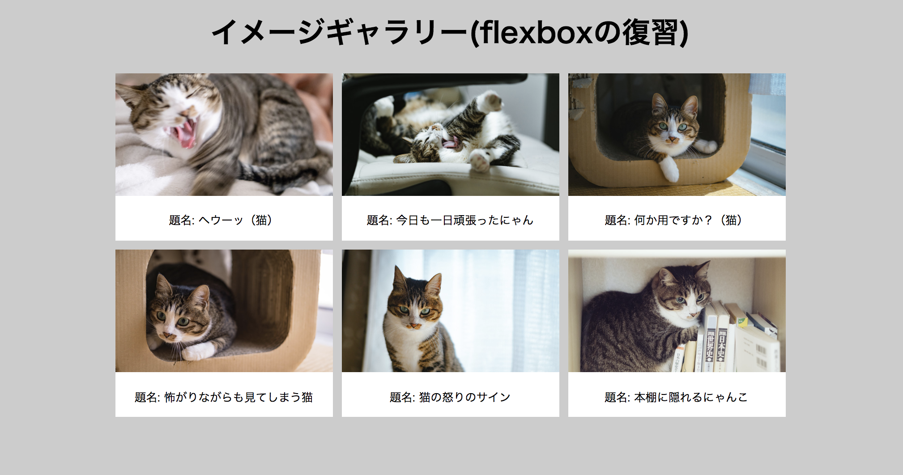

# レポジトリ内容

このレポジトリは[Web白熱教室](https://tsuyopon.xyz/)の[HTMLの学習コンテンツ](https://tsuyopon.xyz/learning-contents/web-dev/html/)にある「[【エクササイズ】ここまで学んできたHTMLの復習その2](https://tsuyopon.xyz/learning-contents/web-dev/html/excercise-html-part-2/)」で利用するものです。

## 課題

以下の完成形と同じページを作ってください。

**完成形**

### 課題をクリアするためのステップ

- [ ] プロフィール画像の上にある自己紹介文はブロック要素である段落タグ(〇タグ)を利用する。
- [ ] 自己紹介で利用する画像はお好きなものを使っていただいて構いません。もし画像がなければ、このレポジトリ内の[images/profile.png](./images/profile.png)をお使いください。
- [ ] プロフィール画像の下にある箇条書き部分では以下内容を記述してください。
  - [ ] 名前
  - [ ] 職業
  - [ ] 出身地
  - [ ] 趣味 (入れ子構造の箇条書きで2つ以上の趣味を記述すること)
- [ ] プロフィール画像下の箇条書きを書き終えたら、その下にh2タグで「リンク」見出しを用意して、その下にTwitterアカウントや、ポートフォリオサイトのリンクを箇条書きで作成してください。
  - もし、インターネット上に自己紹介ページがない場合は、Googleの検索トップページ(https://www.google.co.jp/)へのリンクを作成してください。

## 答え

この課題の答えは、このレポジトリの「index.html」の中身になります。
すぐに答えを見ずに、まずはじめに自分の力だけでチャレンジして、どうしてもわからなくなったら中身を見て、理解したらindex.htmlを閉じて再び自分の力で完成させてください。

## ヒント

- 画像の表示にはimgタグと〇〇〇属性を使います。
  - 参考: [HTMLの属性(アトリビュート)を理解する](https://tsuyopon.xyz/learning-contents/web-dev/html/understand-attributes-in-html/)
- リンクの作成はaタグと〇〇〇〇属性を使います。
  - 参考: [HTMLの属性(アトリビュート)を理解する](https://tsuyopon.xyz/learning-contents/web-dev/html/understand-attributes-in-html/)
- 箇条書き(リスト表示)、入れ子構造のリストは以下でコンテンツで学習しました。
  - 参考: [HTMLのさまざまなリスト表示（箇条書き）のやり方を覚える](https://tsuyopon.xyz/learning-contents/web-dev/html/how-to-make-lists/)
