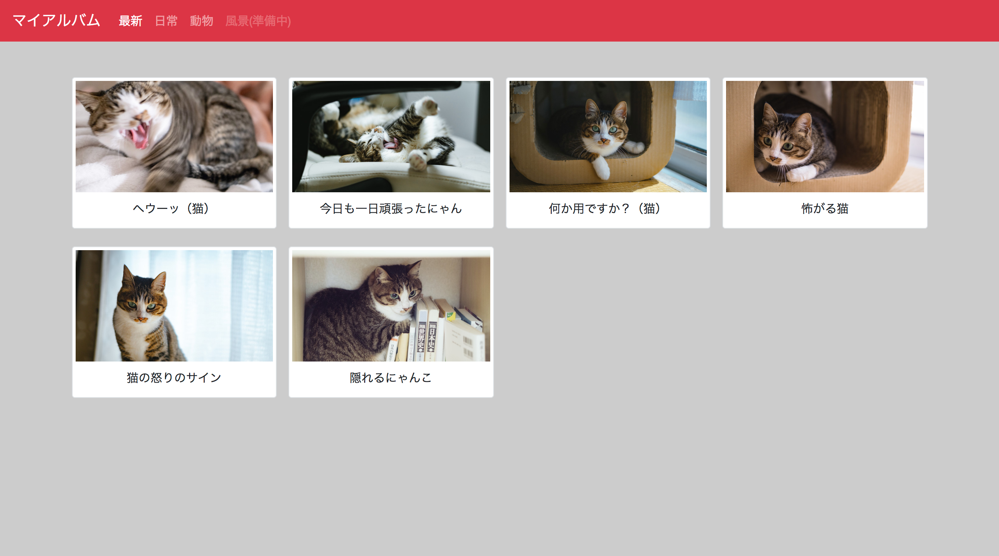

# レポジトリ内容

このレポジトリは[Web白熱教室](https://tsuyopon.xyz/)の[CSSの学習コンテンツ](https://tsuyopon.xyz/learning-contents/web-dev/css/)にある「[【エクササイズ】Bootstrapでレスポンシブなイメージギャラリーを作る](https://tsuyopon.xyz/learning-contents/web-dev/css/css_excercise_for_bootstrap_part_1/)」で利用するものです。

## 課題

以下の完成後と同じページを作ってください。

### 完成前

### 完成後

### 完成後(アニメーション)

### 課題をクリアするためのステップ

- [ ] index.htmlとstyles.cssのコメントに従って、完成後の画像(上記参照)と同じWebページを作成してください
- [ ] 「完成後(アニメーション)」のように画面サイズを変更したときにナビゲーションメニューや画像一覧の表示方法がかわるようなレスポンシブな作りにしてください。
  - index.html内のコメントにしたがって実装を進めればレスポンシブなデザインが完成します

## 答え

- htmlの答えは `answer.html` に記述しています
- cssの答えは `answer.css` に記述しています。
- 全く作業が進められなくなったときに答えを参考にしても良いですが、コピー&ペーストは厳禁です
- 答えを見ながら実装をしたら、もう一度、今度は答えを見ないで実装してください(以下の参考記事を見るのは可能)

## 参考記事

課題をこなしていて、行き詰まったら以下の資料を参考にしていただければ回答にたどり着けるかと思います。

- Web白熱教室
  - [Bootstrapを使う方法](https://tsuyopon.xyz/learning-contents/web-dev/css/how-to-use-the-bootstrap-css/)
  - [BootstrapのNavbarを使う](https://tsuyopon.xyz/learning-contents/web-dev/css/how-to-use-navbar-in-the-bootstrap-css/)
  - [BootstrapのGridシステムを使うパート1](https://tsuyopon.xyz/learning-contents/web-dev/css/how-to-use-navbar-in-the-bootstrap-css-part-1/)
  - [BootstrapのGridシステムを使うパート2](https://tsuyopon.xyz/learning-contents/web-dev/css/how-to-use-navbar-in-the-bootstrap-css-part-2/)
- Bootstrapのドキュメント
  - [Theme colors](https://getbootstrap.com/docs/4.1/getting-started/theming/#theme-colors)
  - [Image thumbnails](https://getbootstrap.com/docs/4.1/content/images/#image-thumbnails)
  - [Spacing](https://getbootstrap.com/docs/4.1/utilities/spacing/)